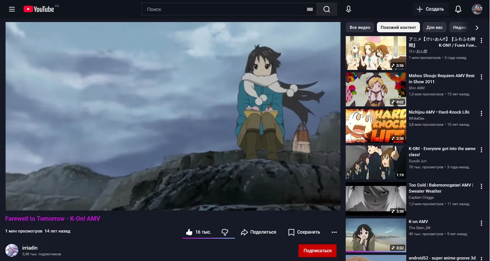
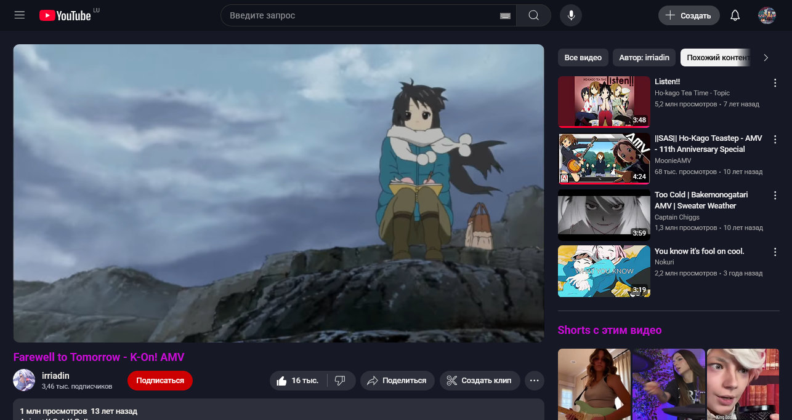

# YouTube-Caramel
Много лет назад, я нашёл код. Со временем я привык к нему. К сожалению автор забросил его, а дизайн начал меняться. Но я не был сломлен, взял и переписал в попытках повторить изначальный дизайн стиля. 

Тот самый стиль [Youtube Sweet](https://github.com/nstgeorge/youtube-sweet)

Тема для Firefox [Sweet-Dark](https://addons.mozilla.org/firefox/addon/sweet-dark/)

### Код я разделил на 2 части. 1 часть это просто цвета. Вторая часть с небольшими изменениями в интерфейсе, и те самые нулевые закругления.

# Скриншоты

